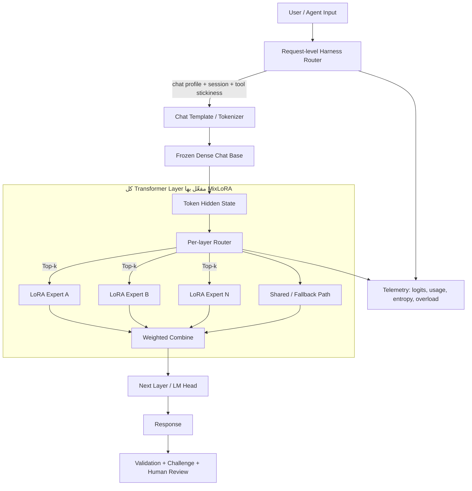
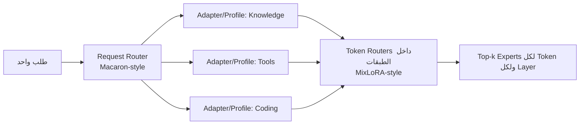
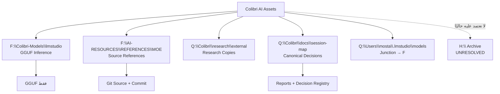
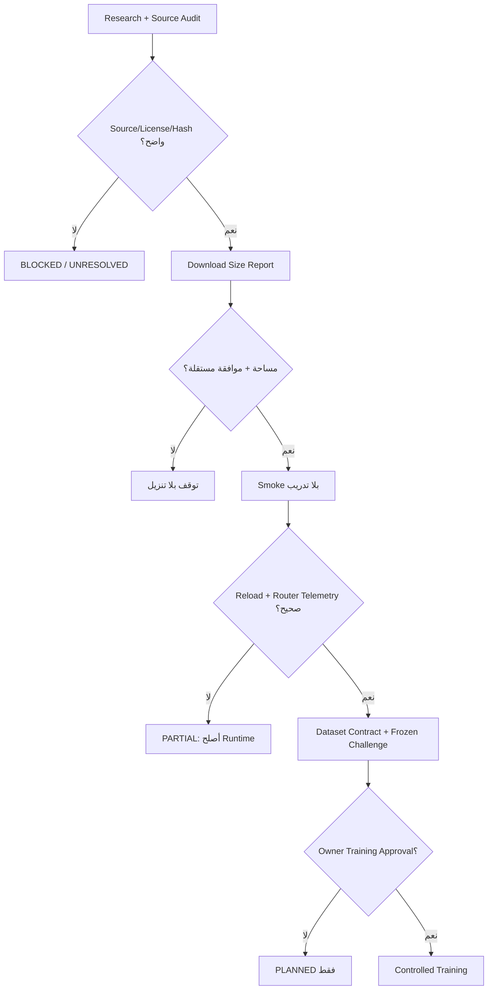
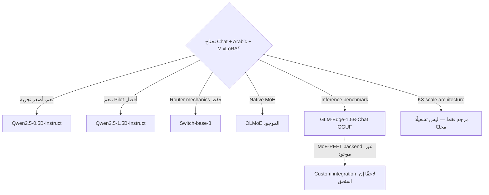

# Sky365 / Colibri — MoE Router Flows

**التاريخ:** 2026-08-16  
**الحالة:** `PLANNED` architecture مبنية على مراجع `VERIFIED`، بلا Training run.

## 1. مسار التعلم والقرار

```mermaid
flowchart LR
    A["Switch-base-8<br/>فهم Top-1 وCapacity"] --> B["Qwen2.5 0.5B Chat<br/>MixLoRA Micro Lab"]
    B --> C["Qwen2.5 1.5B Chat<br/>Arabic Chat Pilot"]
    C --> D["OLMoE الموجود<br/>Native Router Comparison"]
    D --> E["Llama2 + MixLoRA Adapter<br/>Remote Reference Smoke"]
    E --> F["MK7 Router Contract<br/>Experts + Challenge"]
    F -. "Horizon فقط" .-> G["MoST / Kimi K3<br/>Advanced Architecture"]

    classDef learn fill:#e0f2fe,stroke:#0284c7,color:#082f49;
    classDef pilot fill:#ecfccb,stroke:#65a30d,color:#1a2e05;
    classDef gate fill:#fef3c7,stroke:#d97706,color:#451a03;
    classDef horizon fill:#f3e8ff,stroke:#9333ea,color:#3b0764;
    class A,D learn;
    class B,C pilot;
    class E,F gate;
    class G horizon;
```

## 2. Runtime Architecture المتفق عليها

## 3. فصل Request Router عن Token Router

الـRequest Router يحدد سياق/بروفايل الطلب. الـToken Router يعمل داخل الموديل. يمكن جمعهما لاحقًا، لكن لا نعتبرهما Router واحدًا.

## 4. شجرة الأصول والمسارات

## 5. بوابات التنفيذ

## 6. قرار البيز

